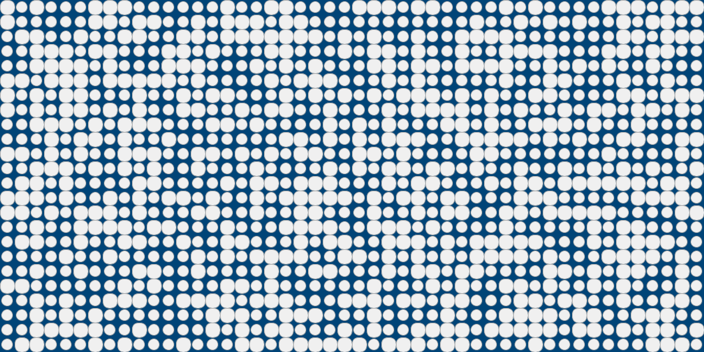
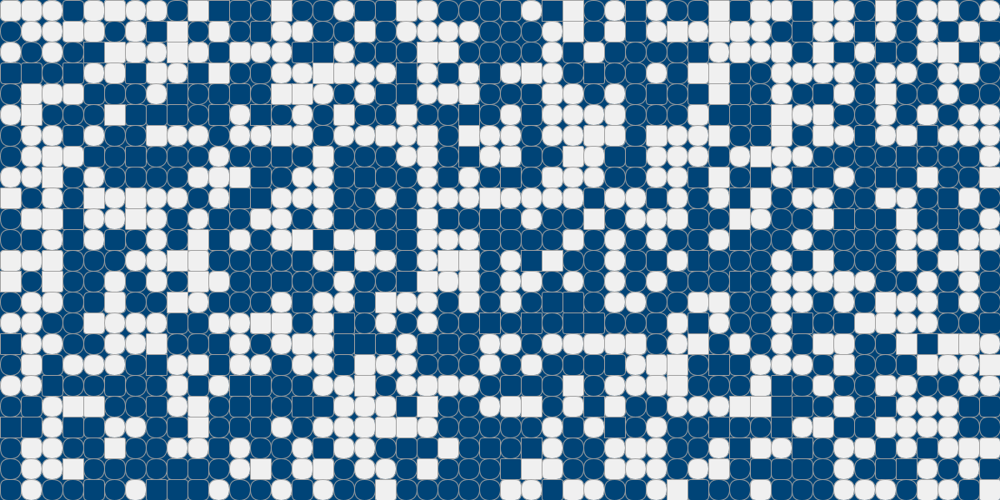
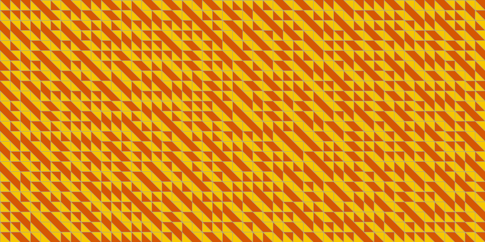
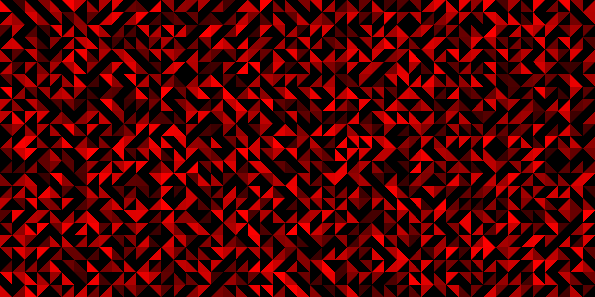
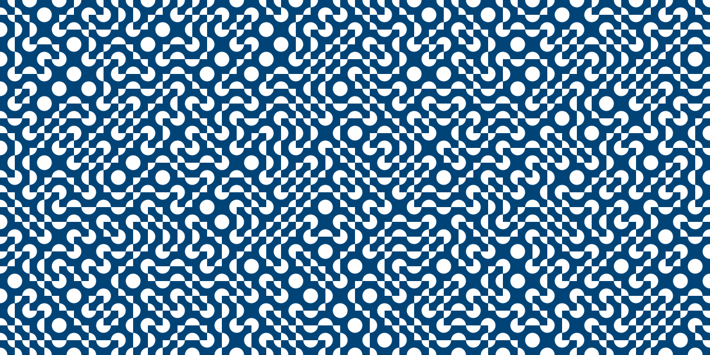

# Truchet Tiles

Experimenting with [Truchet Tile Patterns](https://en.wikipedia.org/wiki/Truchet_tiles) using Python and [Processing](https://www.processing.org)

* [truchet_maze ](truchet_maze)
* [truchet_tile ](truchet_tile)
* [truchet_tile_3 ](truchet_tile_3)
* [truchet_tile_3_1 ](truchet_tile_3_1)
* [truchet_tile_4 ](truchet_tile_4)
* [truchet_tile_4_1 ](truchet_tile_4_1)
* [truchet_tile_fill ](truchet_tile_fill)
